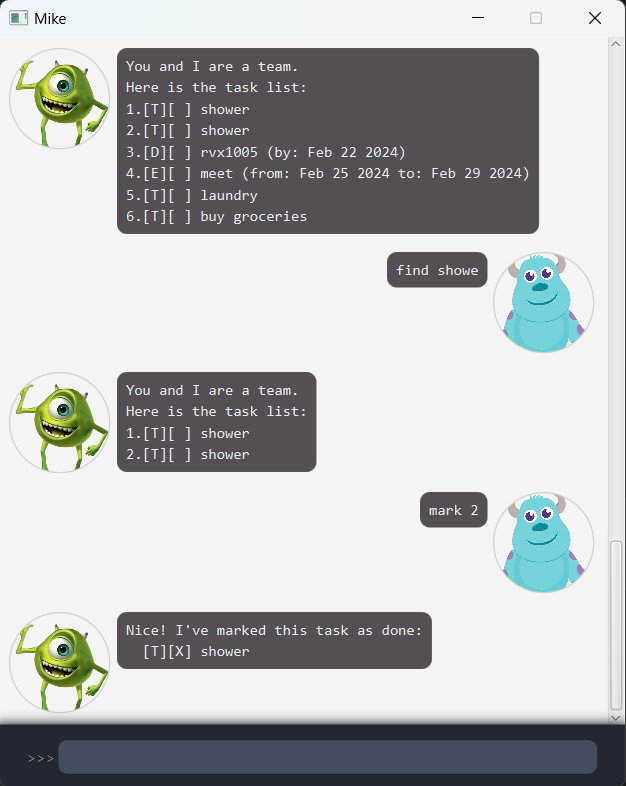

# Mike User Guide

<!-- Product screenshot goes here -->


<!-- Product intro goes here -->

Mike is a purpose built task manager for children proficient in CLI.
Role play as the adorable [Sully](https://disney.fandom.com/wiki/James_P._Sullivan)
from [Monster, Inc.](https://en.wikipedia.org/wiki/Monsters,_Inc.)
with your trusty partner [Mike Wazowski](https://en.wikipedia.org/wiki/Mike_Wazowski) 👿🌞.
Together you will conquer ~~the hearts of children~~ your heart for procrastination.

Through Mike, Sully (you) can quickly add and delete tasks from a tasklist to keep track of what to do, e.g. todos,
events, and deadlines. 

### Installation and Setup
1. Start by downloading the latest version of `mike.jar` from [releases](...)
2. Create a new folder and place the `mike.jar` file into it.
3. Open command line in the same directory as `mike.jar`.
4. Run the command java -jar mike.jar to start the application
```bash
java -jar mike.jar
```

### Command cheatsheet
All commands are inputted into the text field at the bottom of the Gui window.
Here is a list of basic commands and their usage:
- `bye`: exits the application.
- `list`: views the task list.
- `todo [desc]`: creates a todo with a description and adds it to the task list.

---

## Core Features

### Exiting
Use the `bye` command to save and exit the application.

Usage: `bye`
```
>>> bye

Mike: expected output

```

### Listing Tasks
Use the `list` command to view the task list.


---

### Adding Tasks
There are three specific task types: `todo`, `deadline`, and `event`.
Every task must contain a description.
#### Adding Todos
Use the `todo` command to add a todo to the task list.
Give the todo a `description`

Usage: `todo [description]`
```
>>> todo shower

Mike: "Got it, I've added this task:
         [T][ ] shower
       Now you have 1 tasks in the list."

```

#### Adding Deadlines
Use the `deadline` command to add a deadline task to the task list
with the arguments:
- `description`, a description of the deadline
- `date`, the date of the deadline in `YYYY-MM-DD` format.

Usage: `deadline [description] /by [date]`
```
>>> deadline cs2103 iP /by 2024-02-23

Mike: "Got it, I've added this task:
         [D][ ] cs2103 iP (by: 23 Feb 2024)
       Now you have 2 tasks in the list."

```

#### Adding Events
Use the `event` command to add an event task to the task list
with the arguments:
- `description`, a description of the event
- `date`, the starting date of the event in `YYYY-MM-DD` format
- `date`, the ending date of the event in `YYYY-MM-DD` format

Usage: `event [description] /from [date] /to [date]`

```
>>> event meeting /from 2024-02-23 /to 2024-02-23

Mike: "Got it, I've added this task:  
         [E][ ] meeting (from: 23 Feb 2024 to: 23 Feb 2024)
       Now you have 3 tasks in the list."

>>> list

Mike: "You and I are a team.
       Here is the task list:
       1.[T][ ] shower
       2.[D][ ] cs2103 iP (by: 23 Feb 2024)
       3.[E][ ] meeting (from: 23 Feb 2024 to: 23 Feb 2024)"

```
---

### Deleting Tasks
Use the `delete` command to delete tasks from the task list.
Add a task `number` to specify which task to delete.

Usage: `delete [number]`

```
>>> delete 2

Mike: "Noted! I've removed this task: cs2103 iP
         Now you have 2 tasks in the list."

>>> list

Mike: "You and I are a team.
       Here is the task list:
       1.[T][ ] shower
       2.[E][ ] meeting (from: 23 Feb 2024 to: 23 Feb 2024)"
```

---

## Useful Features

### Mark Tasks as Completed
Use the mark command to mark tasks from the task list as completed.
Add a task `number` to specify which task to mark.

Usage: `mark [number]`
```
>>> mark 1

Mike: "I've marked this task as done:
         [T][X] shower"

```

### Mark Tasks as Not Completed
Use the `unmark` command to mark tasks from the task list as not completed.
Add a task `number` to specify which task to unmark.

Usage: `unmark [number]`
```
>>> unmark 1

Mike: "I've marked this task as not done:
         [T][X] shower" 

```

### Find

Use the `find` command to find tasks by keyword.
A task is found if its description contains the substring `keyword`.

Usage: `find [keyword]`
```
>>> find cs2103

Mike: "You and I are a team.
       Here is the task list:
       2.[D][ ] cs2103 iP (by: Feb 23 2024)"

```

### Archive

Use the `archive` command to archive the current task list into a separate save file.
This save file is located at `/archive/[filename].txt`.
The current task list willi also be cleared.

Usage: `archive [filename]`
```
>>> archive old

Mike: "Archive successfully created. Data moved to archive..."

```
